# Test-ResourceContention

## Purpose

- To verify and measure how [resource contention](https://en.wikipedia.org/wiki/Resource_contention) affects [shared resource](https://en.wikipedia.org/wiki/Shared_resource) access iteration count over same amount of time(= 3 seconds). ([Resource contention](https://en.wikipedia.org/wiki/Resource_contention))
- To verify and measure how '[resource contention](https://en.wikipedia.org/wiki/Resource_contention) resolving mechanisms' affects [shared resource](https://en.wikipedia.org/wiki/Shared_resource) access iteration count over same amount of time(= 3 seconds). ([Resource contention](https://en.wikipedia.org/wiki/Resource_contention) resolving mechanism)
- To verify and measure reduction of [resource contention](https://en.wikipedia.org/wiki/Resource_contention) by 'assigning 1 [shared resource](https://en.wikipedia.org/wiki/Shared_resource) per [thread](https://en.wikipedia.org/wiki/Thread_(computing))'. (Reduction of [resource contention](https://en.wikipedia.org/wiki/Resource_contention))

### '[Resource contention](https://en.wikipedia.org/wiki/Resource_contention) resolving mechanisms'

- [Lock](https://en.wikipedia.org/wiki/Lock_(computer_science)) (using [Interlocked API](https://docs.microsoft.com/en-us/windows/win32/sync/interlocked-variable-access))
- [Critical section](https://en.wikipedia.org/wiki/Critical_section)

### 'Assigning 1 [shared resource](https://en.wikipedia.org/wiki/Shared_resource) per [thread](https://en.wikipedia.org/wiki/Thread_(computing))'

- Reduction of [resource contention](https://en.wikipedia.org/wiki/Resource_contention) from 'minimum of 8 [threads](https://en.wikipedia.org/wiki/Thread_(computing)), maximum of 9 [threads](https://en.wikipedia.org/wiki/Thread_(computing)) conflicting over access to 1 [shared resource](https://en.wikipedia.org/wiki/Shared_resource)' to 'minimum of 1 [thread](https://en.wikipedia.org/wiki/Thread_(computing)), maximum of 2 [threads](https://en.wikipedia.org/wiki/Thread_(computing)) conflicting over access to 1 [shared resource](https://en.wikipedia.org/wiki/Shared_resource)'.

## Requirement

- [Multi-core processor](https://en.wikipedia.org/wiki/Multi-core_processor) hardware
- Operating system

## Restriction

- [Thread](https://en.wikipedia.org/wiki/Thread_(computing)) count is fixed to 8.

## Result

### Iteration count of 8 [threads](https://en.wikipedia.org/wiki/Thread_(computing)) accessing non [shared resource](https://en.wikipedia.org/wiki/Shared_resource) (local variable) over same amount of time(= 3 seconds)
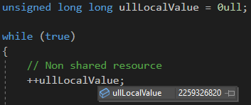
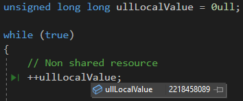
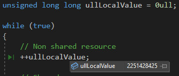
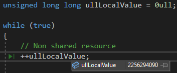
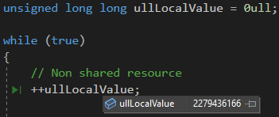
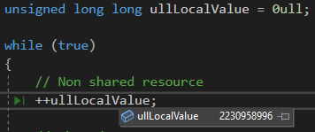
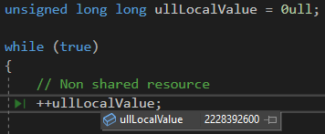
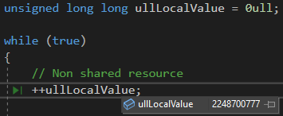

- Average iteration count : **2246624495** (17972995963 / 8 = 2246624495.375)

### Iteration count of 8 [threads](https://en.wikipedia.org/wiki/Thread_(computing)) conflicting over access to 1 [shared resource](https://en.wikipedia.org/wiki/Shared_resource) over same amount of time(= 3 seconds) by [lock](https://en.wikipedia.org/wiki/Lock_(computer_science)) (using [Interlocked API](https://docs.microsoft.com/en-us/windows/win32/sync/interlocked-variable-access))

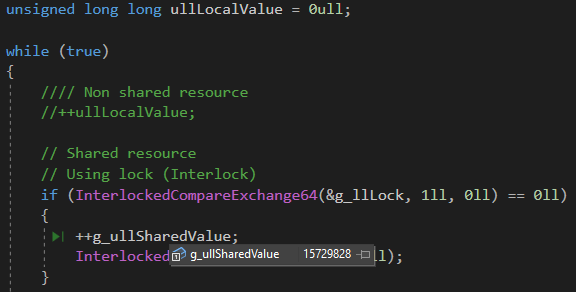

- Iteration count : **15729828**

### Iteration count of 8 [threads](https://en.wikipedia.org/wiki/Thread_(computing)) conflicting over access to 1 [shared resource](https://en.wikipedia.org/wiki/Shared_resource) over same amount of time(= 3 seconds) by [Critical section](https://en.wikipedia.org/wiki/Critical_section)

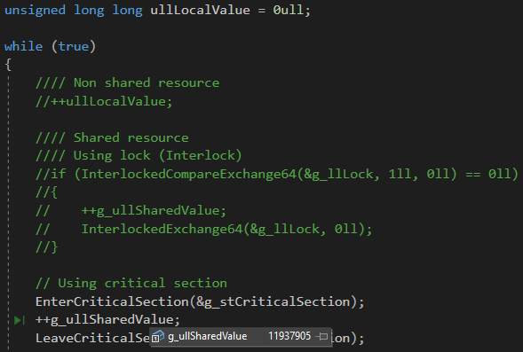

- Iteration count : **11937905**

### Iteration count of 1 [shared resource](https://en.wikipedia.org/wiki/Shared_resource) per [thread](https://en.wikipedia.org/wiki/Thread_(computing)) over same amount of time(= 3 seconds) by [lock](https://en.wikipedia.org/wiki/Lock_(computer_science)) (using [Interlocked API](https://docs.microsoft.com/en-us/windows/win32/sync/interlocked-variable-access))

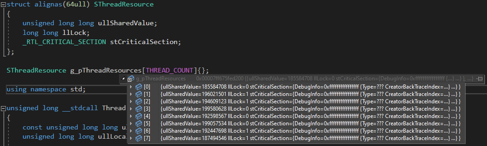

- Average iteration count : **194424288** (1547394305 / 8 = 194424288.125)

### Iteration count of 1 [shared resource](https://en.wikipedia.org/wiki/Shared_resource) per [thread](https://en.wikipedia.org/wiki/Thread_(computing)) over same amount of time(= 3 seconds) by [critical section](https://en.wikipedia.org/wiki/Critical_section)

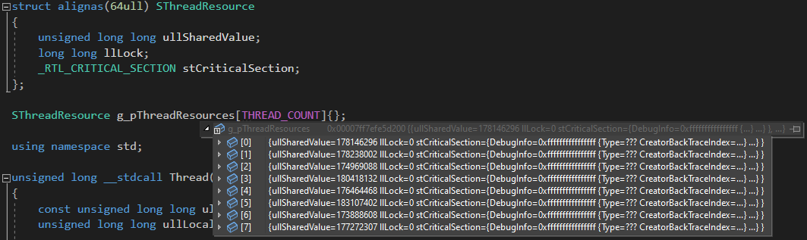

- Average iteration count : **177813038** (1422504303 / 8 = 177813037.875)

## Summary

|Case|[Resource contention](https://en.wikipedia.org/wiki/Resource_contention) resolving mechanism|Iteration count|
|---|---|---|
|8 threads accessing non [shared resource](https://en.wikipedia.org/wiki/Shared_resource)|None|2246624495|
|8 threads conflicting over access to 1 shared resource|[Lock](https://en.wikipedia.org/wiki/Lock_(computer_science)) (using [Interlocked API](https://docs.microsoft.com/en-us/windows/win32/sync/interlocked-variable-access))|15729828|
|8 threads conflicting over access to 1 shared resource|[Critical section](https://en.wikipedia.org/wiki/Critical_section)|11937905|
|8 threads having each [shared resource](https://en.wikipedia.org/wiki/Shared_resource)|[Lock](https://en.wikipedia.org/wiki/Lock_(computer_science)) (using [Interlocked API](https://docs.microsoft.com/en-us/windows/win32/sync/interlocked-variable-access))|194424288|
|8 threads having each [shared resource](https://en.wikipedia.org/wiki/Shared_resource)|[Critical section](https://en.wikipedia.org/wiki/Critical_section)|177813038|

### 8 [threads](https://en.wikipedia.org/wiki/Thread_(computing)) conflicting over 1 [shared resource](https://en.wikipedia.org/wiki/Shared_resource) vs '1 [shared resource](https://en.wikipedia.org/wiki/Shared_resource) per [thread](https://en.wikipedia.org/wiki/Thread_(computing))'
- Iteration count of 1 [shared resource](https://en.wikipedia.org/wiki/Shared_resource) per [thread](https://en.wikipedia.org/wiki/Thread_(computing)) by **[lock](https://en.wikipedia.org/wiki/Lock_(computer_science))** (using [Interlocked API](https://docs.microsoft.com/en-us/windows/win32/sync/interlocked-variable-access)) (**194424288**) was **1236.02%** of iteration count of 8 [threads](https://en.wikipedia.org/wiki/Thread_(computing)) conflicting over 1 [shared resource](https://en.wikipedia.org/wiki/Shared_resource) by **[lock](https://en.wikipedia.org/wiki/Lock_(computer_science))** (using [Interlocked API](https://docs.microsoft.com/en-us/windows/win32/sync/interlocked-variable-access)) (**15729828**).
- Iteration count of 1 [shared resource](https://en.wikipedia.org/wiki/Shared_resource) per [thread](https://en.wikipedia.org/wiki/Thread_(computing)) by **[critical section](https://en.wikipedia.org/wiki/Critical_section)** (**177813038**) was **1489.48%** of iteration count of 8 [threads](https://en.wikipedia.org/wiki/Thread_(computing)) conflicting over 1 [shared resource](https://en.wikipedia.org/wiki/Shared_resource) by **[critical section](https://en.wikipedia.org/wiki/Critical_section)** (**11937905**).

### Lock vs Critical section
- Iteration count of 1 [shared resource](https://en.wikipedia.org/wiki/Shared_resource) per [thread](https://en.wikipedia.org/wiki/Thread_(computing)) by **[lock](https://en.wikipedia.org/wiki/Lock_(computer_science))** (using [Interlocked API](https://docs.microsoft.com/en-us/windows/win32/sync/interlocked-variable-access)) (**194424288**) was **109.34%** of iteration count of 1 [shared resource](https://en.wikipedia.org/wiki/Shared_resource) per [thread](https://en.wikipedia.org/wiki/Thread_(computing)) by **[critical section](https://en.wikipedia.org/wiki/Critical_section)** (**177813038**).

## Note

- [False sharing](https://en.wikipedia.org/wiki/False_sharing) causes significant degradation of performance if the [shared resources](https://en.wikipedia.org/wiki/Shared_resource) per [thread](https://en.wikipedia.org/wiki/Thread_(computing)) is located in same cache block, and two or more cores are accessing the [shared resource](https://en.wikipedia.org/wiki/Shared_resource), eventually leading to cache reload due to [cache coherence](https://en.wikipedia.org/wiki/Cache_coherence).
- Therefore, each [shared resource](https://en.wikipedia.org/wiki/Shared_resource) per [thread](https://en.wikipedia.org/wiki/Thread_(computing)) is aligned to cache line(64) using [alignas specifier](https://en.cppreference.com/w/cpp/language/alignas) and never accessed by other [threads](https://en.wikipedia.org/wiki/Thread_(computing)).

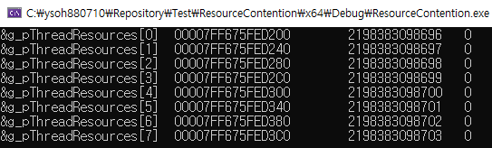
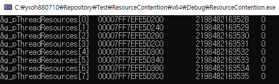

- The address of each [shared resource](https://en.wikipedia.org/wiki/Shared_resource) per [thread](https://en.wikipedia.org/wiki/Thread_(computing)) is aligned to 64 byte showing multiple of 64.
